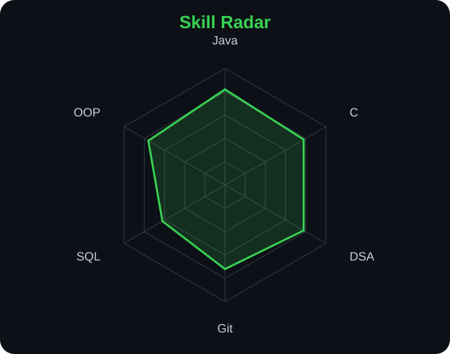
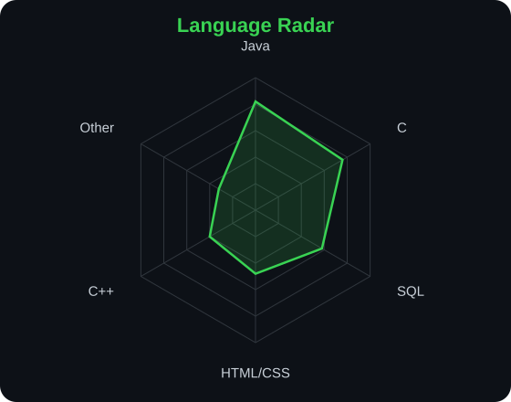

<div align="center">


<br>

<a href="https://github.com/guptadolly458">

</a>

<br>

<a href="https://linkedin.com/in/dolly-gupta-3687b8430/"></a>
<a href="https://github.com/guptadolly458"></a>
<a href="https://leetcode.com/"></a>


</div>

---

## `~/` whoami

```console
$ cat about.txt
```

Hi, I'm **Dolly Gupta**. I'm a B.Tech student who enjoys solving programming problems, learning new technologies, and turning ideas into working code.

- Currently focused on **Java, C, DSA and problem solving**
- Learning and practicing **OOP, SQL, Git & GitHub**
- Building and experimenting with **[ShinigamiCode](https://github.com/guptadolly458/ShinigamiCode)**
- Practicing regularly through coding problems and projects
- Fun fact: **I learn best by building things and debugging them myself.**

<br>

<div align="center">

## `~/` toolbox


</div>

---


## 🧩 LeetCode

<p align="center">
    <a href="https://leetcode.com/u/dollygupta123/">
  
</a>
    <div align="center">


<em>🌸 One problem, one note, one day at a time. 🎹</em>
  </a>
</p>


---

## 🔥 GitHub Streak

<p align="center">
  
</p>

---

## 🌐 Connect With Me

<p align="center">

<a href="https://www.linkedin.com/in/dolly-gupta-3687b8430/">

</a>

<a href="https://github.com/guptadolly458">

</a>

<a href="https://leetcode.com/u/dollygupta123/">

</a>

</p>

---


<div align="center">

## 🎼 `~/ skill radar`
<table>
<tr>
<td width="50%" align="center">
<picture>
<source media="(prefers-color-scheme: dark)" srcset="assets/radar-dark.svg">
<source media="(prefers-color-scheme: light)" srcset="assets/radar-light.svg">

</picture>
</td>
<td width="50%" align="center">
<picture>
<source media="(prefers-color-scheme: dark)" srcset="assets/radar-langs-dark.svg">
<source media="(prefers-color-scheme: light)" srcset="assets/radar-langs-light.svg">

</picture>
</td>
</tr>
</table>


<em>🌸 Learning, building, and improving — one skill at a time. 🎻</em>

</div>

---

<div align="center">


## 🌸 `~/ contribution calendar`
<picture>
<source media="(prefers-color-scheme: dark)" srcset="assets/metrics.isocalendar.svg">
<source media="(prefers-color-scheme: light)" srcset="assets/metrics.isocalendar.svg">

</picture>

<br><br>

<picture>
<source media="(prefers-color-scheme: dark)" srcset="https://raw.githubusercontent.com/guptadolly458/guptadolly458/output/snake-dark.svg">
<source media="(prefers-color-scheme: light)" srcset="https://raw.githubusercontent.com/guptadolly458/guptadolly458/output/snake.svg">

</picture>

</div>

<em>🎻 Moving forward, one contribution at a time. 🌸</em>

</div>


---

<div align="center">


---
<div align="center">

## 🌸 `~/ selected work`

<table>
<tr>

<td width="50%" valign="top">

### 💻 ShinigamiCode

A coding space for my DSA practice, Java learning and development journey.

<p>


</p>

<a href="https://github.com/guptadolly458/ShinigamiCode">
  <strong>Explore Repository →</strong>
</a>

</td>

<td width="50%" valign="top">

### 📚 assignment

Assignments, practice programs and academic work.

<p>


</p>

<a href="https://github.com/guptadolly458/assignment">
  <strong>Explore Repository →</strong>
</a>

</td>

</tr>

<tr>

<td width="50%" valign="top">

### ☕ Bridgelabz-Demo

Java practice, demos and programming exercises.

<p>


</p>

<a href="https://github.com/guptadolly458/Bridgelabz-Demo">
  <strong>Explore Repository →</strong>
</a>

</td>

<td width="50%" valign="top">

### 🎓 Bridgelabz-Training-1Y

Training exercises, Java practice and learning progress.

<p>


</p>

<a href="https://github.com/guptadolly458/Bridgelabz-Training-1Y">
  <strong>Explore Repository →</strong>
</a>

</td>

</tr>
</table>

<br>

<em>🌸 Learning • Building • Practicing • Growing 🌸</em>

</div>

---

<div align="center">
<sub>`01110100 01101000 01100001 01101110 01101011 01110011 00100000 01100110 01101111 01110010 00100000 01110011 01100011 01110010 01101111 01101100 01101100 01101001 01101110 01100111`</sub>
</div>
<p align="center">

### ⭐ Thanks for visiting my profile!

</p>
